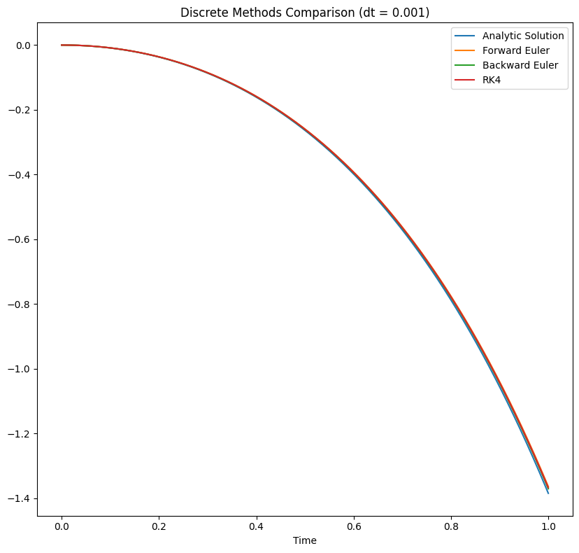
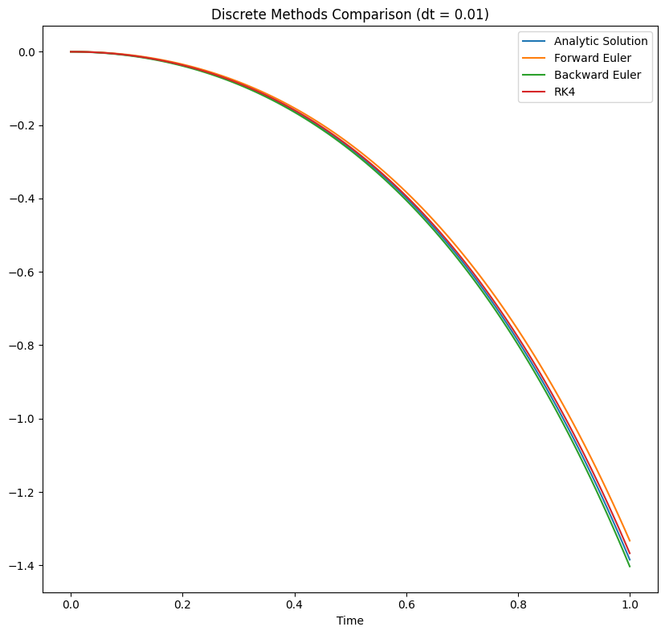
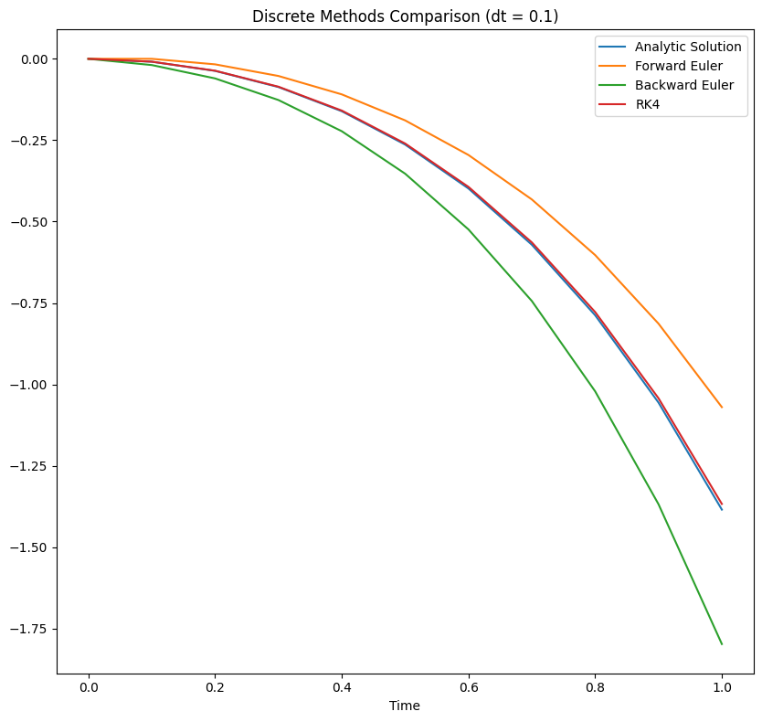
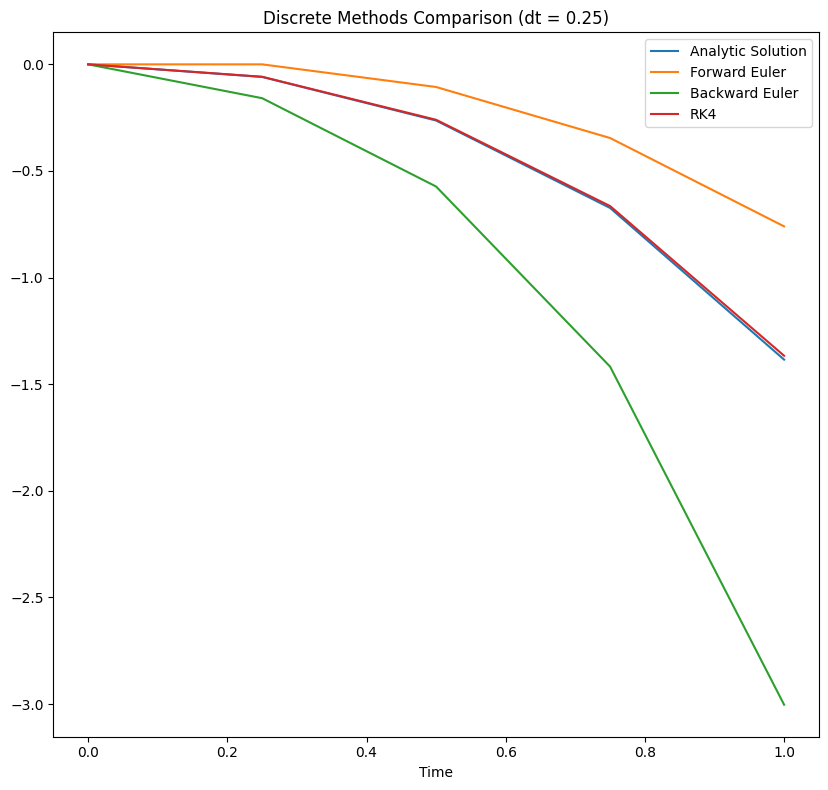

# Task 1
Student: Huynh Tan Cuong  
ISU: 336231  
Group: R4136c  

## Analytical Solution

We solve the linear second-order ODE with constant coefficients by splitting it into the homogeneous solution (solving the characteristic equation) and a particular solution for the constant forcing. Then we determine the integration constants from the initial conditions.

The ODE is:
$$a \cdot \ddot{x} + b \cdot \dot{x} + c \cdot x = d$$
with parameters
$$
\begin{cases}
a = 4.62 \\\\
b = -4.68 \\\\
c = -5.74 \\\\
d = -7.95
\end{cases}
$$

1. Solve the homogeneous equation (set right-hand side to zero).
The characteristic equation is
$$ a\lambda^2 + b \lambda + c = 0 $$
so
$$ 4.62\lambda^2 - 4.68\lambda -5.74 = 0. $$
Solving this quadratic gives two real roots (eigenvalues):
$$
\begin{cases}
\lambda_1 = -0.717827 \\\\
\lambda_2 = 1.73081
\end{cases}
$$
Thus the general homogeneous solution is
$$ x_h(t) = C_1 e^{\lambda_1 t} + C_2 e^{\lambda_2 t}. $$

2. Find a particular solution for the constant forcing d.
Because the forcing is constant, try a constant particular solution x_0. Substituting into the ODE gives
$$ c \cdot x_0 = d $$
so
$$ x_0 = \frac{d}{c} \approx \frac{-7.95}{-5.74} \approx 1.385. $$

3. Combine homogeneous and particular solutions.
The general solution of the nonhomogeneous ODE is
$$ x(t) = C_1 e^{\lambda_1 t} + C_2 e^{\lambda_2 t} + x_0 $$
or explicitly
$$ x(t) = C_1 e^{-0.717827 t} + C_2 e^{1.73081 t} + 1.385. $$

4. Apply initial conditions to determine C1 and C2.
Given
$$
\begin{cases}
x(0) = 0 \\\\
\dot{x}(0) = 0
\end{cases}
$$
we obtain the linear system
$$
\begin{cases}
C_1 + C_2 + 1.385 = 0 \\\\
C_1 \lambda_1 + C_2 \lambda_2 = 0
\end{cases}
$$
or equivalently
$$
\begin{cases}
C_1 + C_2 = -1.385 \\\\
C_1 \cdot (-0.717827) + C_2 \cdot 1.73081 = 0
\end{cases}
$$
Solving this system gives
$$
\begin{cases}
C_1 = -0.978994 \\\\
C_2 = -0.406023
\end{cases}
$$

5. Final solution.
Substituting the constants back yields
$$
x(t) = -0.978994\, e^{-0.717827 t} - 0.406023\, e^{1.73081 t} + 1.385.
$$

This completes the analytic solution: the transient behavior is given by the two exponentials and the steady-state value is the constant x_0 ≈ 1.385.

## Numerical Solution

### State-Space Representation

We can represent the second-order ODE as a first-order system by defining the state vector
$$
\mathbf{X} = \begin{bmatrix}
x \\\\
\dot{x}
\end{bmatrix}
$$
Then the state-space representation is given by

$$
\dot{X} = A \mathbf{X} + B
$$
where
$$
A = \begin{bmatrix}
0 & 1 \\\\
\frac{-c}{a} & \frac{-b}{a}
\end{bmatrix}, \quad
B = \begin{bmatrix}
0 \\\\
\frac{d}{a}
\end{bmatrix}
$$

### Forward Euler Method

To solve the system numerically, we can use the Forward Euler method. Given a time step $h$, the update equations are
$$
x_{k+1} = x_k + h \cdot f(x_k)
$$

### Backward Euler Method

In the Backward Euler method, we use the state at the next time step to compute the update. The update equations become
$$
x_{k+1} = x_k + h \cdot f(x_{k+1})
$$

### Runge-Kutta 4th-order Method

The Runge-Kutta 4th-order method (RK4) provides a more accurate solution by considering multiple slopes at each time step. The update equations are given by
$$
\begin{align*}
f_1 &= f(x_k) \\\\
f_2 &= f\left(x_k + \frac{h}{2} f_1\right) \\\\
f_3 &= f\left(x_k + \frac{h}{2} f_2\right) \\\\
f_4 &= f\left(x_k + h f_3\right) \\\\
x_{k+1} &= x_k + \frac{h}{6} \left( f_1 + 2f_2 + 2f_3 + f_4 \right)
\end{align*}
$$

### Results 

The results of the numerical simulations are shown in the following figures.

Observations:
The bigger the time step, the more pronounced the numerical artifacts, especially in the Forward Euler method. The RK4 method shows better stability and accuracy across different time steps.

## Conclusion

In this report, we have analyzed the numerical solutions of a second-order ordinary differential equation using various integration methods. The Forward Euler method, while simple, is prone to instability and inaccuracies for larger time steps. The Backward Euler method offers improved stability at the cost of increased computational complexity. Finally, the Runge-Kutta 4th-order method provides the best accuracy and stability across all tested time steps.

